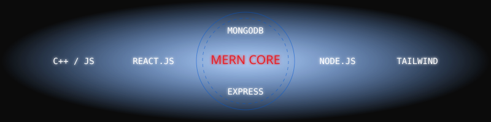

  <!-- Arrival into Spider-Verse & The "Barsat" Vibe -->
  

  

 

  

## 🕷️ IDENTITY REVEAL
**Subject:** Mritunjay "Nihal" Nagar  
**Location:** India (Earth-199999)  
**Profile:** 21-year-old Full Stack Web Developer & MERN Stack Specialist.  
Passionate about scalable web applications and continuously learning modern technologies[cite: 1]. Currently solving DSA and LeetCode pattern-wise while preparing for Software Engineering roles[cite: 1].

 

## 📖 ORIGIN STORY 
*Every hero has a beginning. Here is where the foundation was built.*

*   **Lovely Professional University**: Bachelor of Technology - Computer Science and Engineering (Aug '24 - Present) | CGPA: 7.05[cite: 1]
*   **Pacific University**: Polytechnic Diploma in Computer Science and Engineering (Aug '21 - Jun '24) | CGPA: 6.73[cite: 1]
*   **Swami Vivekanand Govt. Model School**: Matriculation (Apr '20 - Mar '21) | Percentage: 81[cite: 1]

### 🏢 Stark Industries... err, Professional Experience
*   **Kamal Fin cap PVT. LTD.**: Full Stack Web Development Intern (Jun '25 - Aug '25). Designed responsive UI screens, built backend API endpoints, and gained practical full-stack project experience[cite: 1].
*   **Pixel Vibe**: Intern (May '23 - Jul '23). Gained hands-on exposure to real-world digital workflows and strengthened problem-solving techniques[cite: 1].

  

## ⚙️ TECH ARSENAL (Stark Hologram UI)
*The tools equipped in my web-shooters to build the multiverse.*

*   **Frontend Technology**: React.js, Tailwind CSS, HTML/CSS[cite: 1]
*   **Backend Technology**: Node.js, Express.js, REST APIs, MongoDB[cite: 1]
*   **Languages**: C++, JavaScript[cite: 1]
*   **Tools & Platforms**: Jest, Redis, Git, GitHub, Figma (UI/UX), Postman, Visual Studio Code[cite: 1]
*   **Multiverse Expansion (Currently Exploring)**: Spring Boot, Apache Kafka, Docker.

  

## 🎯 CURRENT MISSION: SHIELD TERMINAL
<table align="center" style="border-collapse: collapse; border: 2px solid #E62429; background-color: #0B0B0B; width: 100%;">
  <tr>
    <td align="center" style="padding: 20px;">
      <h3 style="color: #FFFFFF; font-family: monospace;">> MISSION LOG_</h3>
      
[STATUS: ACTIVE]

      <ul style="text-align: left; color: #FFFFFF; list-style-type: none;">
        <li>✔️ <strong>Solving DSA Pattern Wise:</strong> Mastering algorithms in the training ground[cite: 1].</li>
        <li>✔️ <strong>Preparing for SDE Roles:</strong> Enhancing system design and logical structuring[cite: 1].</li>
        <li>✔️ <strong>Broadcasting:</strong> Managing digital content creation via the ALIEN YT network.</li>
      </ul>
    </td>
  </tr>
</table>

 

## ⚔️ TRAINING GROUND (DSA)
*Honing the Spider-Sense through algorithmic combat.*

**Primary Base:** [DSA-PATTERN-PREP Repository](https://github.com/Nihalnagar28/DSA-PATTERN-PREP)

  

 

  <em>Achievement Unlocked: Solved 150+ DSA problems on platforms like LeetCode and GeeksforGeeks[cite: 1]. Successfully completed a DSA Summer Bootcamp[cite: 1].</em>

  

## 🔬 SPIDER LAB (Projects & Certifications)
> *"Projects are continuously evolving inside my repositories. Let the code speak for itself."*

**Notable Blueprints from the Lab:**
*   **Virtual Study Room**: Built a real-time collaborative platform with video calling, live chat, and screen sharing using React.js, Node.js, and WebRTC[cite: 1].
*   **AI Packing Assistant**: Created an AI-powered list generator integrating the Weather-Stack API for personalized travel recommendations[cite: 1].
*   **Dynamic Resume Builder**: Developed a web app with customizable sections and PDF generation functionality[cite: 1].

**Certifications:**
*   Dynamic Programming Camp - Algo University[cite: 1]
*   Master Generative AI and tool - Infosys[cite: 1]
*   ChatGPT-4 Prompt Engineering - Infosys[cite: 1]
*   Data Structures and Algorithm - lamneo Platform[cite: 1]

 

## 🌐 CONTACT PORTAL
*Open a portal to my dimension.*

  
  
  
  

 

  
  <h3 style="color: #E62429; font-style: italic;">"With Great Code Comes Great Responsibility."</h3>

